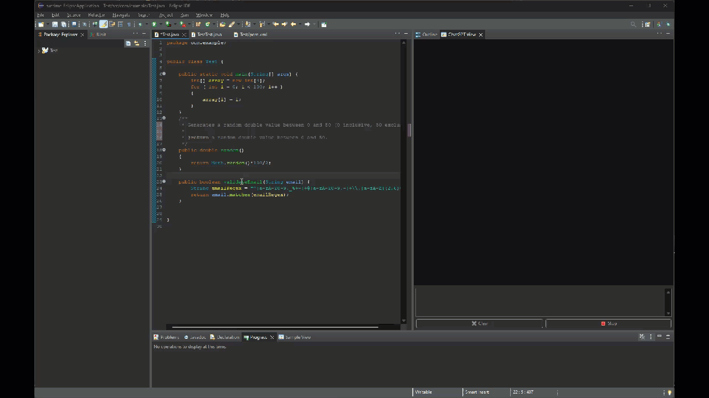

# AssistAI - A ChatGPT Plugin for Eclipse IDE

AssistAI is an Eclipse IDE plugin that integrates ChatGPT functionality. The plugin is experimental and was mainly tested with Eclipse 2023/03.

## Features

1. Refactor a selected portion of your code by asking ChatGPT
2. Generate JavaDoc comments for a selected class or method using ChatGPT
3. Create JUnit tests for a selected class or method with ChatGPT's assistance
4. Discuss the content of the currently opened file with ChatGPT
5. Fix compile errors with ChatGPT
6. Copy code blocks from ChatGPT to the clipboard
7. Generate Git commit comments based on the staged files' changes

You can also ask general questions, like with a regular ChatGPT.

## Context

The plugin utilizes the OpenAI API to send predefined prompts to ChatGPT, which include the context of your IDE, such as:

- File name
- Content of the opened file
- Selected class or method name

If you are unsatisfied with the results, you can ask follow-up questions to ChatGPT. Your questions will be sent along with the complete conversation history, helping ChatGPT provide more accurate answers.

Use the "Clear" button to reset the conversation context. To stop ChatGPT from generating a response, press the "Stop" button.

## Usage Examples

1. To discuss the class you're working on, select "Discuss" from the "Code Assist AI" context menu and ask any question about the code.

2. To refactor a code snippet, select it and choose "Refactor" from the "Code Assist AI" context menu.

3. You can also ask ChatGPT to document a selected class or method using the "Document" command:

4. Finally, you can ask ChatGPT to generate a JUnit test:

## Installation

### Plugin installation

To install the Assist AI plugin in your IDE follow these steps:

1. Download the latest release zip file: https://github.com/gradusnikov/eclipse-chatgpt-plugin/releases
2. In Eclipse IDE open *Help > Install new software*
3. Open the "add repository" window with the  *Add*... button set the location of the .zip file using *Archive...* button
4. Select the .zip file as the "Repository Archive" and press *Add*
5. Select "Assist AI" from the plugin list and proceed to the next step with *Next* button
6. Accept any certificate warnings (note: this is a self signed plugin, so you will be warned about the security risks)

### Configuration

Once the plugin is installed you need to configure access to **OpenAI API**.

1. Open *Window > Preferences > Assist AI* preferences
2. Enter your **OpenAI API** key (you can find your keys at https://platform.openai.com/account/api-keys)
3. Enter the model name. By default the plugin uses *gpt-4* model, but you can also use *gpt-3.5-turbo* or any ChatGPT model that is available to you 

### Add ChatGPT View

Add *ChatGPT View* to your IDE: 

1. Open *Window > Show View > Other*
2. From *Code Assist AI* select *ChatGPT View*

