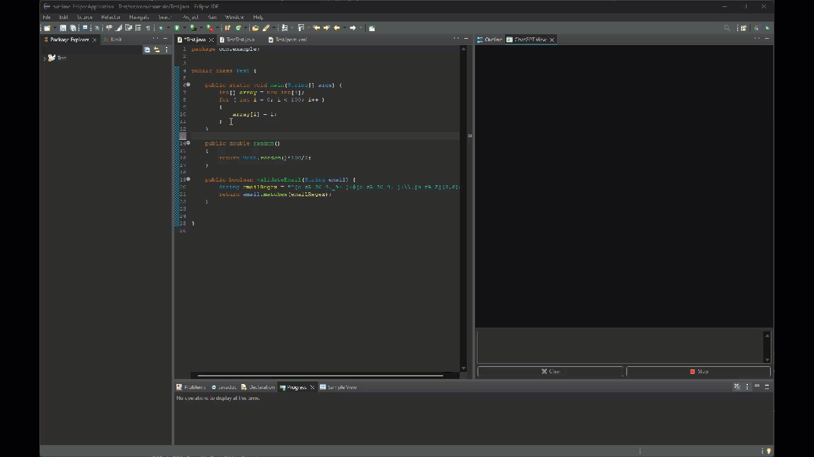
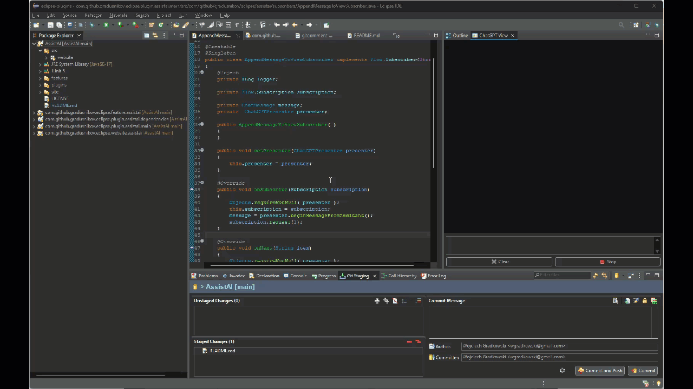

    

# AssistAI - A ChatGPT Plugin for Eclipse IDE

AssistAI is an Eclipse IDE plugin that brings ChatGPT functionality into your development environment. This experimental plugin has been primarily tested with Eclipse 2023/03.

## Features

1. Refactor selected code snippets by asking ChatGPT
2. Generate JavaDoc comments for chosen classes or methods with ChatGPT's help
3. Create JUnit tests for selected classes or methods using ChatGPT's assistance
4. Engage in a conversation with ChatGPT about the content of the currently opened file
5. Fix compilation errors with ChatGPT's guidance
6. Copy code blocks generated by ChatGPT to the clipboard
7. Produce Git commit comments based on changes in staged files

You can also pose general questions to ChatGPT, just like with the regular ChatGPT interface.

## Context

The plugin leverages the OpenAI API to send predefined prompts to ChatGPT. These prompts include relevant context from your IDE, such as:

- File name
- Content of the opened file
- Selected class or method name

If you're not satisfied with the results, you can ask follow-up questions to ChatGPT. Your inquiries, along with the complete conversation history, will be sent to ChatGPT, ensuring more precise answers.

Use the "Clear" button to reset the conversation context. Press the "Stop" button to halt ChatGPT's response generation.

## Usage Examples

1. To discuss the class you're working on, select "Discuss" from the "Code Assist AI" context menu and ask any question about the code.

2. To refactor a code snippet, select it and choose "Refactor" from the "Code Assist AI" context menu.

3. You can also ask ChatGPT to document a selected class or method using the "Document" command:

4. Additionally, you can request ChatGPT to generate a JUnit test:

5. After staging all modified files, ask ChatGPT to create a Git commit message:

6. If you have errors in your code, ChatGPT can generate a patch to solve your issues. Select "Fix Errors" command, copy patch contents using the "Copy Code" button, and paste it to your project with CTRL+v

## Installation

### Plugin Installation

Follow these steps to install the Assist AI plugin in your IDE:

1. In Eclipse IDE, open *Help > Install new software*
2. Click the *Add* button to open the "add repository" window, and input `AssistAI` as *Name* and `https://eclipse-chatgpt-plugin.lm.r.appspot.com/` as *Location*
3. Click *Add*
4. Back in *Install* window, choose *AssistAI* from the  *Work with:* list
4. Select "Assist AI" from the plugin list and proceed to the next step by clicking the *Next* button
5. Accept any certificate warnings (note: this is a self-signed plugin, so you will be warned about potential security risks)

### Configuration

After installing the plugin, configure access to the **OpenAI API**:

1. Open *Window > Preferences > Assist AI* preferences
2. Input your **OpenAI API** key (you can find your keys at https://platform.openai.com/account/api-keys)
3. Input the model name. By default, the plugin uses the *gpt-4* model, but you can also utilize *gpt-3.5-turbo* or any available ChatGPT model

### Add ChatGPT View

Add the *ChatGPT View* to your IDE:

1. Open *Window > Show View > Other*
2. Select *ChatGPT View* from the *Code Assist AI* category

